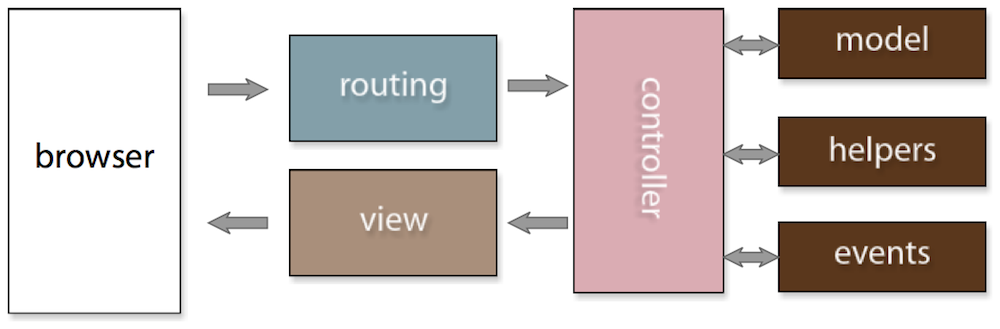

!SLIDE subsection transition=scrollUp
# Elgg Basics
## From nothing to newb in no time at all!

!SLIDE center
# Elgg Blitz!

!SLIDE bullets
# Social engine.
* Social features.
* Not limited to traditional "social networks."
* More than a framework, less than a turnkey solution.
* (More than CakePHP, less than Wordpress.)

!SLIDE bullets
# Tech specs
* Runs on LAMP (MySQL >= 5, PHP >= 5.2).
* MVC based.
* Front controller with two controllers.
* Object oriented and procedural.
* Convention and configuration.
* Modular plugins system.

!SLIDE bullets
# Important concepts
* Data model (M).
* Views (V).
* Actions and page handlers (C).
* Events and plugin hooks (extends the core MVC).

!SLIDE center
# Elgg application flow

Thanks for the pic, Cash!

!SLIDE subsection transition=scrollUp
# Model

!SLIDE bullets incremental left smaller
# Data model
* Entities: Generic storage classes.
	
ElggObject, ElggUser, ElggGroup, ElggSite.

	
ElggObject <- ElggBlog, ElggPlugin, ElggWidget.

* Extenders: Describe entities.
	
ElggMetadata, ElggAnnotation.

* Relationships - Connects entities.
	
ElggUser "is_member" ElggGroup

	
ElggUser "friend" ElggUser
