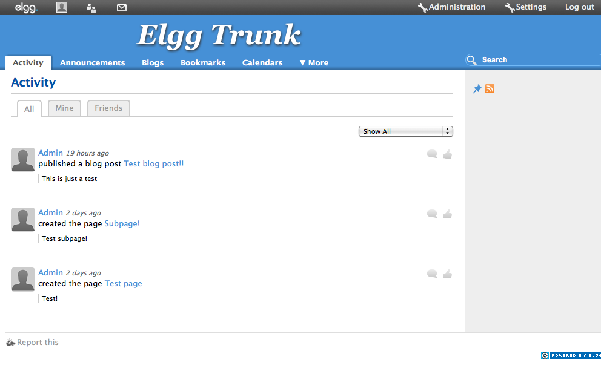
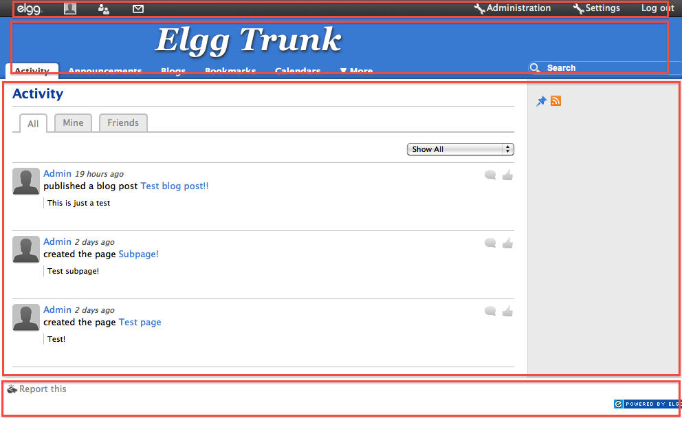
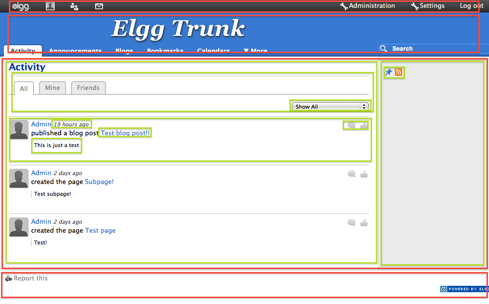

!SLIDE subsection transition=scrollUp
# Views

!SLIDE bullets
# Views are easy!
* Just PHP scripts.
* Output chunks of content.
* Overrideable: replace content of original view.
* Extensible: prepend or append content to original view.

!SLIDE center

!SLIDE center

!SLIDE center

!SLIDE bullets incremental smaller
# Working with views
* View scripts are stored in `views/` dirs.
* View scripts are mapped to view name strings.
* New views use convention: put in `views/` and it Just Works™.
* Extending views use configuration: `elgg_extend_view($view_name, $view_extension_name)`

!SLIDE bullets smallest left
# View locations
## View names are just parts of the file path!
* View:
	
page/elements/header_logo

* Core view script:
	
elgg/views/default/page/elements/header_logo.php

!SLIDE bullets smallest left
# Overriding view locations
## Duplicate the view script directory path structure in a plugin
* View:
	
page/elements/header\_logo

* Core view script:
	
elgg/<strong>views/default/page/elements/header\_logo.php
</strong>
* Plugin override:
	
elgg/mod/my_theme/<strong>views/default/page/elements/header\_logo.php</strong>

	
!SLIDE bullets smallest left
# Core vs Plugins
## Core:
	elgg/
	└── views/
		└── default/
			└── page/
				└── elements/
					└── header_logo.php
_____

## Plugin:
	elgg/
	└── mod/
	    └── my_theme/
	        └── views/
		        └── default/
		  	        └── page/
		  	 	        └── elements/
		  	 		        └── header_logo.php

!SLIDE bullets most-smallest left
# Overriding view locations
## Overriding views from other plugins.
* View:
	
page/elements/header\_logo

* Core view script:
	
elgg/<strong>views/default/page/elements/header\_logo.php
</strong>
* Plugin override:
	
elgg/mod/my_theme/<strong>views/default/page/elements/header\_logo.php</strong>

* <strong>Another plugin override:</strong>
	
elgg/mod/special_theme/<strong>views/default/page/elements/header\_logo.php</strong>

* Override priority is determined by plugin load priority in Advanced Plugin section.

!SLIDE bullets smaller left
# Default?
## elgg/views/<strong class="blue">default</strong>/page/elements/header\_logo.php
* Views can output anything! HTML, RSS, JSON, serialized PHP.
* The `default` dir name is the view type.
* View types can be changed on any URL by appending:
	
`?view=<viewtype>`

* RSS view type scripts live in: 
	
elgg/views/<strong class="blue">rss</strong>/page/elements/header\_logo.php

* RSS view type URLs look like:
	
http://www.elggsite.org/activity?<strong class="blue">view=rss</strong>

	
!SLIDE
# Questions?