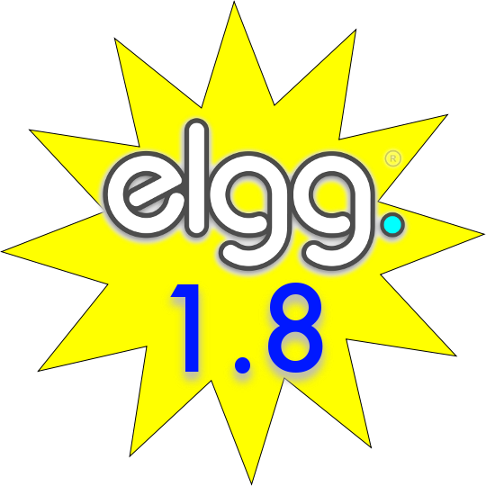

!SLIDE center

# ElggCamp Santiago 2011
## <em>Dev Edition</em>
### Brett Profitt
### @brettprofitt • brett@elgg.org • http://el.gg/ecstgo11feedback

!SLIDE bullets incremental
# Who's talking?
* Hi, I'm Brett.
* Involved with Elgg since 2007.
* Lead developer for Elgg since 2009.
* From Columbus, Ohio.
* \#yawn.

!SLIDE bullets
# Who am I talking to?
* Hands up!

!SLIDE bullets incremental
## Drop your hand if you have:
* ...contributed code to Elgg core.
* ...written an Elgg plugin.
* ...contributed to a PHP framework.
* ...used a PHP framework.
* ...written anything in PHP.
* ...wandered in on accident.

!SLIDE bullets incremental
# The Plan
* Elgg basics
* Plugin basics
* Tour of 1.8 Bookmarks plugin
* Plugin workshop with Emilio

!SLIDE bullets
# Things to look for if you're a 1.7 dev:
* Antipatterns (aka: Things not to do).
* New features.
* Deprecated features.

!SLIDE bullets
# ASK QUESTIONS!
* Raise your hand.
* Speak out.
* @brettprofitt, @emdagon

!SLIDE center

# http://elgg.org/elgg-1.8.zip